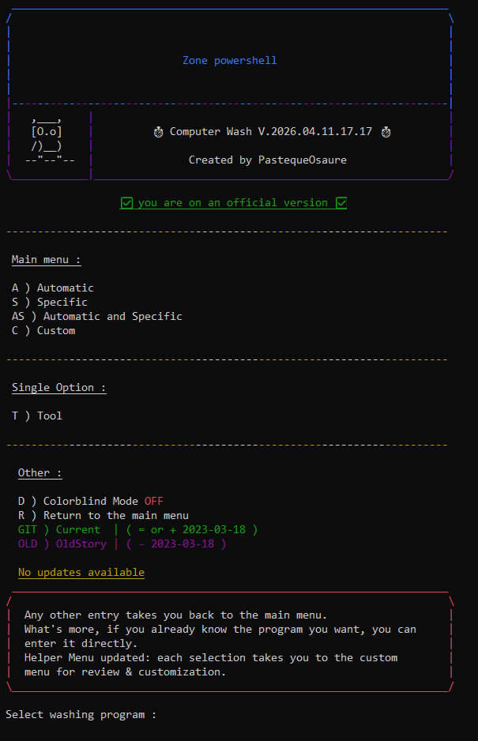
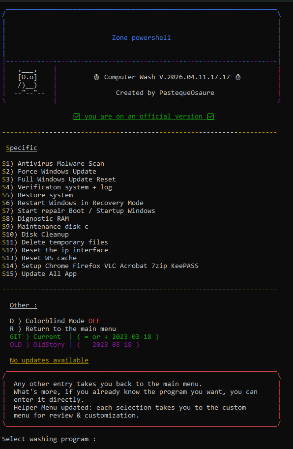
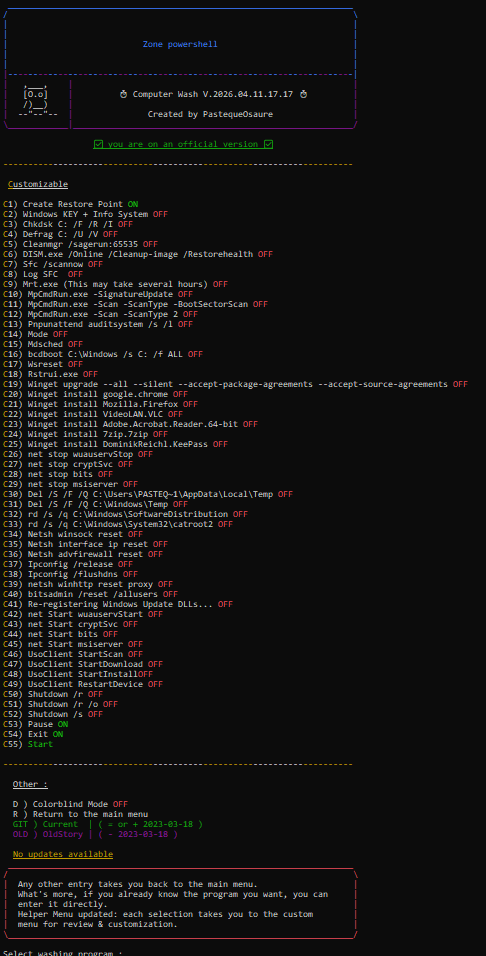
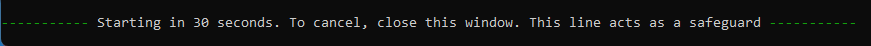
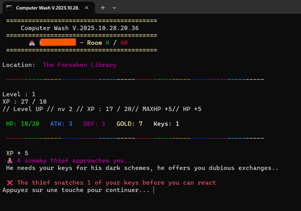

# 📘 Computer Wash

Computer Wash is a Windows utility that allows you to clean, repair, and optimize your system using automated commands. 

🏝️ It relies exclusively on Windows internal commands, with no installation required !

📘 General Instructions

1. 🚀 Launch the program.  
2. 🎯 Select the automatic tasks (A1–A5) and/or specific tasks (S1–S16) according to your needs.  
3. ☑️ Configure the main menu (C1–C54) if necessary.  
4. 👀 Follow the on-screen instructions and wait for the operations to complete.  
5. 🔄 Certain functions have an auto-retry option; they restart automatically in case of failure.

⚠️ **Important:** Selecting C55 "Start" is mandatory to launch the main program. All other choices are used to configure or prepare tasks before execution.  
The script deactivates standby once it is started and reactivates it at the end.

🛗 The program is organized into three levels: Automatic Tasks

🐳 Main Menu 

🐛 Automatic Tasks (A1–A5)

| Code | Task | Description |
|------|------|-------------|
| 🫧 A1   | Daily Wash | Daily system cleaning (DISM + SFC) |
| 🧼 A2   | Maintenance Wash | Daily Wash + temporary file deletion |
| 🚿 A3   | Washing Repair | Maintenance Wash + Chkdsk + Log SFC + and disk cleanup |
| 🛁 A4   | Last Resort Wash | Ultimate cleaning with all available tools = Washing Repair + Antivirus Malware Scan + Reset the IP Interface + Reset WS Cache + reboot |
| 🛀 A5   | Update All Apps | Automatic update of all installed applications via Winget |

The order of execution of commands can be found in the Custom menu.

📷 Screenshot Automatic Tasks (A1–A5)

🐦‍⬛ Specific Tasks (S1–S16)

| Code | Task | Description |
|------|------|-------------|
| ☣️ S1   | Antivirus Malware Scan | Full scan with MRT and MpCmdRun |
| 💪 S2   | Force Windows Update | Launch Windows Update immediately |
| 🔄 S3   | Full Windows Update Reset | Complete reset of the Windows Update service |
| 🛃 S4   | System Verification + Log | System check and log generation |
| 🏥 S5   | Restore System | Restore the system to a restore point |
| 🐦‍🔥 S6   | Restart Windows in Recovery Mode | Restart Windows in recovery mode |
| 🛠️ S7   | Start Repair Boot / Startup Windows | Repair system boot using bcdboot |
| 🚣 S8   | RAM Diagnostic | Run memory test (Mdsched + Shutdown /r) |
| 💾 S9   | Maintenance Disk C | Check system disk (Chkdsk) |
| 📀 S10  | Disk Cleanup | Disk cleanup with Cleanmgr and temporary file deletion |
| 📑 S11  | Delete Temporary Files | Delete all temporary files |
| 🌐 S12  | Reset the IP Interface | Reset IP interface + Winsock + firewall + flush DNS |
| 🏪 S13  | Reset WS Cache | Reset Windows Store cache |
| ✨ S14  | Setup Chrome, Firefox, VLC, Acrobat, 7zip, KeePass | Install/update main software |
| 🎈 S15  | Update All Apps | Update all applications via Winget |
| 🔏 S16  | Computer Wash USB Protection | Enable USB protection (if activated in the script) |

The order of execution of commands can be found in the Custom menu.

📷 Screenshot Specific Tasks (S1–S16)

🦚 Customizable Menu (C1–C55)

| Code | Command / Action | Default Status |
|------|-----------------|----------------|
| 🃏 C1   | Create Restore Point | ON |
| 🃏 C2   | Windows KEY + Info System | OFF |
| 🃏 C3   | Chkdsk C: /F /R /I | OFF |
| 🃏 C4   | Defrag C: /U /V | OFF |
| 🃏 C5   | Cleanmgr /sagerun:65535 | OFF |
| 🃏 C6   | DISM.exe /Online /Cleanup-image /Restorehealth | OFF |
| 🃏 C7   | Sfc /scannow | OFF |
| 🃏 C8   | Log SFC | OFF |
| 🃏 C9   | Mrt.exe full scan (may take several hours) | OFF |
| 🃏 C10  | MpCmdRun.exe -SignatureUpdate | OFF |
| 🃏 C11  | MpCmdRun.exe -Scan -ScanType -BootSectorScan | OFF |
| 🃏 C12  | MpCmdRun.exe -Scan -ScanType 2 | OFF |
| 🃏 C13  | Pnpunattend auditsystem /s /l | OFF |
| 🃏 C14  | Mode | OFF |
| 🃏 C15  | Mdsched | OFF |
| 🃏 C16  | bcdboot C:\Windows /s C: /f ALL | OFF |
| 🃏 C17  | Wsreset | OFF |
| 🃏 C18  | Rstrui.exe | OFF |
| 🃏 C19  | winget upgrade --all --silent | OFF |
| 🃏 C20  | Winget install google.chrome | OFF |
| 🃏 C21  | Winget install Mozilla.Firefox | OFF |
| 🃏 C22  | Winget install VideoLAN.VLC | OFF |
| 🃏 C23  | Winget install Adobe.Acrobat.Reader.64-bit | OFF |
| 🃏 C24  | Winget install 7zip.7zip | OFF |
| 🃏 C25  | Winget install DominikReichl.KeePass | OFF |
| 🃏 C26  | net stop wuauservStop | OFF |
| 🃏 C27  | net stop cryptSvc | OFF |
| 🃏 C28  | net stop bits | OFF |
| 🃏 C29  | net stop msiserver | OFF |
| 🃏 C30  | Del /S /F /Q C:\Users\PASTEQ~1\AppData\Local\Temp | OFF |
| 🃏 C31  | Del /S /F /Q C:\Windows\Temp | OFF |
| 🃏 C32  | rd /s /q C:\Windows\SoftwareDistribution | OFF |
| 🃏 C33  | rd /s /q C:\Windows\System32\catroot2 | OFF |
| 🃏 C34  | Netsh winsock reset | OFF |
| 🃏 C35  | Netsh interface ip reset | OFF |
| 🃏 C36  | Netsh advfirewall reset | OFF |
| 🃏 C37  | Ipconfig /release | OFF |
| 🃏 C38  | Ipconfig /flushdns | OFF |
| 🃏 C39  | netsh winhttp reset proxy | OFF |
| 🃏 C40  | bitsadmin /reset /allusers | OFF |
| 🃏 C41  | Re-registering Windows Update DLLs | OFF |
| 🃏 C42  | net Start wuauservStart | OFF |
| 🃏 C43  | net Start cryptSvc | OFF |
| 🃏 C44  | net Start bits | OFF |
| 🃏 C45  | net Start msiserver | OFF |
| 🃏 C46  | UsoClient StartScan | OFF |
| 🃏 C47  | UsoClient StartDownload | OFF |
| 🃏 C48  | UsoClient StartInstall | OFF |
| 🃏 C49  | UsoClient RestartDevice | OFF |
| 🃏 C50  | Shutdown /r | OFF |
| 🃏 C51  | Shutdown /r /o | OFF |
| 🃏 C52  | Shutdown /s | OFF |
| 🃏 C53  | Pause | ON |
| 🃏 C54  | Exit | ON |
| 🃏 C55  | Start | Mandatory |

The order of execution of commands can be found in the Custom menu.

📷 Screenshot Customizable Menu (C1–C55)

📌 Notes

- The script supports arguments (ComputerWash.cmd only)
- The script automatically displays the order of commands and their execution status (ON/OFF).  
- You have 30 seconds to close Computer Wash after launching.

- Verify all Shutdown parameters before starting the process.  
- Some commands may take several minutes to execute (Chkdsk, Mrt.exe, DISM, Sfc…).  
- Administrative privileges are required for proper execution.  
- Winget commands will install or update software if enabled.  
- Cleanup and reset commands may modify the system and delete temporary files: back up your important data.

🏰 Roglike (Batch Edition)

A tiny roguelike made entirely in Windows Batch, originally designed as a hidden Easter Egg… and then it became a standalone mini-game!  
Explore the mysterious dungeon rooms, face monsters, manage your gold and keys… and see how far you can get.

🎮 Gameplay

- Move room by room until you reach the dungeon’s end.  
- Each room may hide a random event or a monster (monsters appear every 7 rooms).  
- Your choices shape your survival: careful management of HP, gold, and keys is key.  
- No two runs are alike: randomness and risk management rule the game.

⚔️ Player Stats

- ❤️ **HP** – Health Points.  
- 🗡 **ATK** – Attack.  
- 🛡 **DEF** – Defense.  
- 💰 **Gold** – Currency for buying, healing, or opening doors.  
- 🔑 **Keys** – Used to open sealed doors.

🧩 Possible Events

- 🛏 **Inn**: fully restores HP.  
- 🛒 **Merchant**: sells useful items… for a price.  
- 💰 **Trapped Treasure**: big rewards… or big losses.  
- 🦹 **Thief**: a shady figure who may take your keys or trade them for gains.  
- 🚪 **Sealed Door**: without a key, you must pay dearly to pass.  
- 🏦 **Bank**: store your riches… if you dare.  
- ☠️ **Pact**: dramatically boosts stats… at a mysterious cost.

🎲 Combat

- Monsters appear when room is divisible by 7
- Monsters may drop gold… and one key.

🔑 Keys & Doors

- Keys are rare but valuable:  
  - Open sealed doors safely.  
  - Avoid traps or unexpected losses.  
- Without keys, progress comes at a heavy cost in gold or HP.

🎲 Game Philosophy

- This started as a hidden Easter Egg: there’s no grand victory, only challenge and discovery.  
- The goal is to experiment through multiple runs, learn the mechanics, and optimize choices.  
- RNG is tricky: mismanagement leads to consequences.

🔑 How to Access

The script may give you a **first hint** to reach this hidden dungeon… sometimes.  
Patience, courage, and curiosity are required to uncover the full path.  
Once discovered, the game will launch itself as a **Batch roguelike**.

⚠️ This Easter Egg unfolds through an investigation that starts with the first secret command.
Try multiple times, and stay sharp… hidden secrets may reveal themselves.

